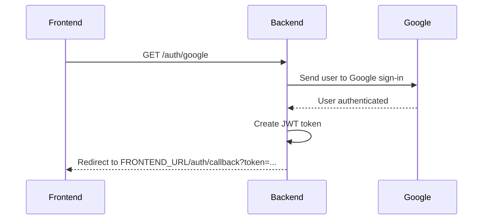

# ResumeAI Backend

ResumeAI is the backend server for a resume assistant app. It handles login, Google sign-in, resume processing, and API responses for the frontend.

This README is written for beginners and explains what happens step by step.

---

## 1. What This Project Does

The backend does four main things:

1. Lets a user create an account with email and password.
2. Lets a user log in with email and password.
3. Lets a user sign in with Google.
4. Protects resume features so only logged-in users can use them.

When the frontend talks to this backend, it sends requests to routes like `/auth/google` or `/resume/analysis`.

---

## 2. What Happens When You Click Google Register

This is the code in your frontend:

```js
const handleGoogleRegister = () => {
  if (!serverUrl) {
    setError("Server URL is not configured.");
    return;
  }
  window.location.href = `${serverUrl}/auth/google`;
};
```

Here is what happens in simple words:

1. The function checks if `serverUrl` exists.
2. If `serverUrl` is missing, it shows the message `Server URL is not configured.`
3. If `serverUrl` is available, the browser moves to `serverUrl/auth/google`.
4. That request reaches the backend route `GET /auth/google`.
5. The backend sends the user to Google sign-in using Passport.
6. The user signs in with Google.
7. Google sends the user back to `GET /auth/google/callback` on the backend.
8. The backend creates a JWT token for the user.
9. The backend redirects the browser to the frontend with the token in the URL.

In short: clicking the button sends the browser to the backend, the backend sends the browser to Google, and after login the backend sends the browser back to your app with a token.

---

## 3. Google Login Flow

The Google login flow is handled in two routes. These routes do not use a JSON request body or JSON response body.

### `GET /auth/google`

This starts the Google login process.

Request body:

```json
{}
```

In the backend, this route uses Passport with the Google strategy:

```ts
passport.authenticate('google', { scope: ['profile', 'email'], session: false })
```

This means:

1. Ask Google for the user’s profile.
2. Ask Google for the user’s email.
3. Do not use server sessions.

Response body:

```json
{}
```

Actual response: a redirect to Google's login page.

### `GET /auth/google/callback`

This route runs after Google login is finished.

Request body:

```json
{}
```

If Google login works:

1. The backend reads the Google user information.
2. The backend creates a token with `signToken(...)`.
3. The backend redirects the browser to the frontend.

The redirect looks like this:

```text
FRONTEND_URL/auth/callback?token=YOUR_JWT_TOKEN
```

If `FRONTEND_URL` is not set in the environment, the backend uses:

```text
http://localhost:3000
```

Response body:

```json
{}
```

Actual response: a redirect to `FRONTEND_URL/auth/callback?token=...`.

---

## 4. Other Login Options

The backend also supports normal email and password login.

### Register

`POST /auth/register`

Request body:

```json
{
  "name": "John Doe",
  "email": "john@example.com",
  "password": "secret123"
}
```

What the backend does:

1. Checks that all fields exist.
2. Makes sure the email is not already used.
3. Hashes the password so it is not stored as plain text.
4. Saves the new user in the database.
5. Creates a JWT token.
6. Returns the user data and token.

Response body:

```json
{
  "success": true,
  "data": {
    "token": "jwt-token-here",
    "user": {
      "id": "user-id",
      "email": "john@example.com",
      "name": "John Doe"
    }
  },
  "message": "User registered successfully",
  "timestamp": "2026-07-04T12:00:00.000Z"
}
```

### Login

`POST /auth/login`

Request body:

```json
{
  "email": "john@example.com",
  "password": "secret123"
}
```

What the backend does:

1. Checks that email and password were sent.
2. Finds the user in the database.
3. Compares the password with the saved hashed password.
4. If the password is correct, creates a JWT token.
5. Returns the user data and token.

Response body:

```json
{
  "success": true,
  "data": {
    "token": "jwt-token-here",
    "user": {
      "id": "user-id",
      "email": "john@example.com",
      "name": "John Doe"
    }
  },
  "message": "Login successful",
  "timestamp": "2026-07-04T12:00:00.000Z"
}
```

---

## 5. Resume Routes

Resume routes are protected by login.

That means the frontend must send a valid token before using them.

The app file shows this rule:

```ts
app.use("/resume", requireAuth, resumeRouter);
```

So before any resume route runs, the backend checks if the user is authenticated.

The resume router includes these routes:

### `GET /resume/history`

This returns the saved resume history for the logged-in user.

Request body:

```json
{}
```

Headers:

```http
Authorization: Bearer YOUR_JWT_TOKEN
```

Response body:

```json
{
  "success": true,
  "data": {
    "items": [
      {
        "id": "history-id",
        "title": "Resume Analysis",
        "prevScore": 68,
        "newScore": 81,
        "unfixedResume": "https://...",
        "fixedResume": "https://...",
        "timestamp": "2026-07-04T12:00:00.000Z"
      }
    ]
  },
  "message": "Resume history fetched successfully.",
  "timestamp": "2026-07-04T12:00:00.000Z"
}
```

### `POST /resume/analysis`

Uploads a resume file, analyzes it, and stores the original resume history.

Request body:

This route uses `multipart/form-data`.

```text
resume: <file>
```

Response body:

```json
{
  "success": true,
  "data": {
    "title": "Software Engineer Resume",
    "overallScore": 82,
    "atsScore": 80,
    "formattingScore": 84,
    "keywordScore": 81,
    "impactScore": 79,
    "clarityScore": 83,
    "creativityScore": 70,
    "grade": "B+",
    "recruiterVerdict": "Strong candidate with room to sharpen impact.",
    "overallFeedback": "...",
    "strengths": [],
    "weaknesses": [],
    "missedOpportunities": [],
    "grammarIssues": [],
    "impactUpgrades": [],
    "creativityBoosts": [],
    "keywordSuggestions": [],
    "formattingTips": [],
    "redFlags": [],
    "candidatePersona": {
      "archetype": "...",
      "tone": "...",
      "standoutFactor": "...",
      "hiringRisk": "low",
      "hiringRiskReason": "..."
    },
    "historyId": "history-id",
    "resumeContent": "raw extracted resume text"
  },
  "message": "Resume analysis completed successfully.",
  "timestamp": "2026-07-04T12:00:00.000Z"
}
```

### `POST /resume/generate`

Generates a polished resume PDF from a previous analysis result.

Request body:

```json
{
  "templateId": "classic",
  "analysis": {
    "title": "Software Engineer Resume",
    "overallScore": 82,
    "atsScore": 80,
    "formattingScore": 84,
    "keywordScore": 81,
    "impactScore": 79,
    "clarityScore": 83,
    "creativityScore": 70,
    "grade": "B+",
    "recruiterVerdict": "Strong candidate with room to sharpen impact.",
    "overallFeedback": "...",
    "strengths": [],
    "weaknesses": [],
    "missedOpportunities": [],
    "grammarIssues": [],
    "impactUpgrades": [],
    "creativityBoosts": [],
    "keywordSuggestions": [],
    "formattingTips": [],
    "redFlags": [],
    "candidatePersona": {
      "archetype": "...",
      "tone": "...",
      "standoutFactor": "...",
      "hiringRisk": "low",
      "hiringRiskReason": "..."
    },
    "historyId": "history-id",
    "resumeContent": "raw extracted resume text"
  }
}
```

Response body:

```json
{
  "success": true,
  "data": {
    "polishSummary": {
      "changesApplied": ["Fixed typo in summary"],
      "scoreImprovementAreas": ["Impact"],
      "atsKeywordsInjected": ["React"],
      "estimatedNewScore": 88
    },
    "buffer": {
      "type": "Buffer",
      "mimeType": "pdf",
      "data": [1, 2, 3]
    },
    "historyId": "history-id",
    "fixedResumeUrl": "https://..."
  },
  "message": "Resume generated successfully.",
  "timestamp": "2026-07-04T12:00:00.000Z"
}
```

The route also sends the file as an attachment with this header:

```http
Content-Disposition: attachment; filename="resume_formatted.pdf"
```

If the user is not logged in, these routes should be blocked by `requireAuth`.

---

## 6. Test Route

### `POST /test/chat`

Sends a message to Gemini and returns a chat-style response.

Request body:

```json
{
  "message": "Write a short intro for my resume",
  "context": "I am a frontend engineer"
}
```

Response body:

```json
{
  "success": true,
  "data": {
    "response": "...",
    "context": "..."
  },
  "message": "Message processed successfully",
  "timestamp": "2026-07-04T12:00:00.000Z"
}
```

### `GET /test/pdf`

Creates a sample PDF from mock resume data.

Request body:

```json
{}
```

Response body:

```json
{
  "success": true,
  "data": {
    "type": "Buffer",
    "data": [1, 2, 3]
  },
  "message": "Resume has been created successfully!",
  "timestamp": "2026-07-04T12:00:00.000Z"
}
```

### `POST /test/r2-upload`

Uploads one PDF file to R2 for a storage smoke test.

Request body:

This route uses `multipart/form-data`.

```text
resume: <file>
```

Response body:

```json
{
  "success": true,
  "data": {
    "key": "resumes/test-user/test-upload/unfixed-...-resume.pdf",
    "url": "https://...",
    "fileName": "resume.pdf"
  },
  "message": "PDF uploaded to R2 successfully",
  "timestamp": "2026-07-04T12:00:00.000Z"
}
```

### `GET /test/userhistory`

Returns the logged-in user history in the same shape as `/resume/history`.

Request body:

```json
{}
```

Headers:

```http
Authorization: Bearer YOUR_JWT_TOKEN
```

Response body:

```json
{
  "success": true,
  "data": {
    "items": []
  },
  "message": "Resume history fetched successfully.",
  "timestamp": "2026-07-04T12:00:00.000Z"
}
```

---

## 7. Important Backend Files

### Main app setup

The main Express app is in [src/app.ts](src/app.ts).

It:

1. Enables CORS.
2. Parses JSON request bodies.
3. Initializes Passport for Google login.
4. Mounts the routes.
5. Connects to MongoDB.

### Server start file

The server startup code is in [src/server.ts](src/server.ts).

It:

1. Loads environment variables.
2. Makes sure the upload folder exists.
3. Starts the server on the port from `.env`.

---

## 8. Environment Variables

This project expects values like these in your `.env` file:

```env
PORT=3000
MONGODB_URI=your_mongodb_connection_string
FRONTEND_URL=http://localhost:3000
```

If Google login is used, Passport Google settings are also required in the project configuration.

---

## 9. Simple Frontend Example

This is a beginner-friendly explanation of the Google button:

```js
const handleGoogleRegister = () => {
  if (!serverUrl) {
    setError("Server URL is not configured.");
    return;
  }

  window.location.href = `${serverUrl}/auth/google`;
};
```

What this means:

1. If the server address is missing, stop and show an error.
2. If the server address exists, open the backend Google login page.
3. The browser leaves the current page because `window.location.href` changes the page.

This is normal behavior for Google sign-in. The browser must leave your app and visit Google for authentication.

---

## 10. Beginner Glossary

### Backend

The server code that runs behind the frontend.

### Route

A URL path like `/auth/login` or `/resume/analysis`.

### JWT token

A small signed string that proves the user is logged in.

### Passport

A library used here to handle Google authentication.

### Redirect

When the browser automatically moves to another URL.

### Middleware

Code that runs before the route handler, often used for authentication or file uploads.

---

## 11. Login Flow Summary

Here is the full Google login flow in one place:



---

## 12. Notes For PDF Export

This README is written in a clean format so it can be exported to PDF easily.

If you want, you can also add screenshots of:

1. The frontend Google button.
2. The Google login page.
3. The redirect URL after login.

Those screenshots can make the PDF easier for beginners to understand.

---

## License

This project is licensed under ISC.
